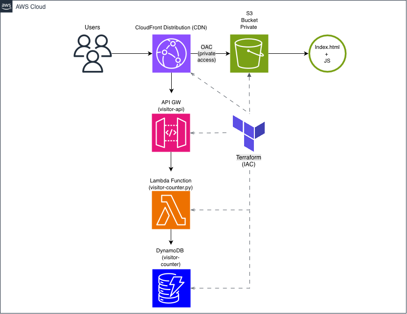
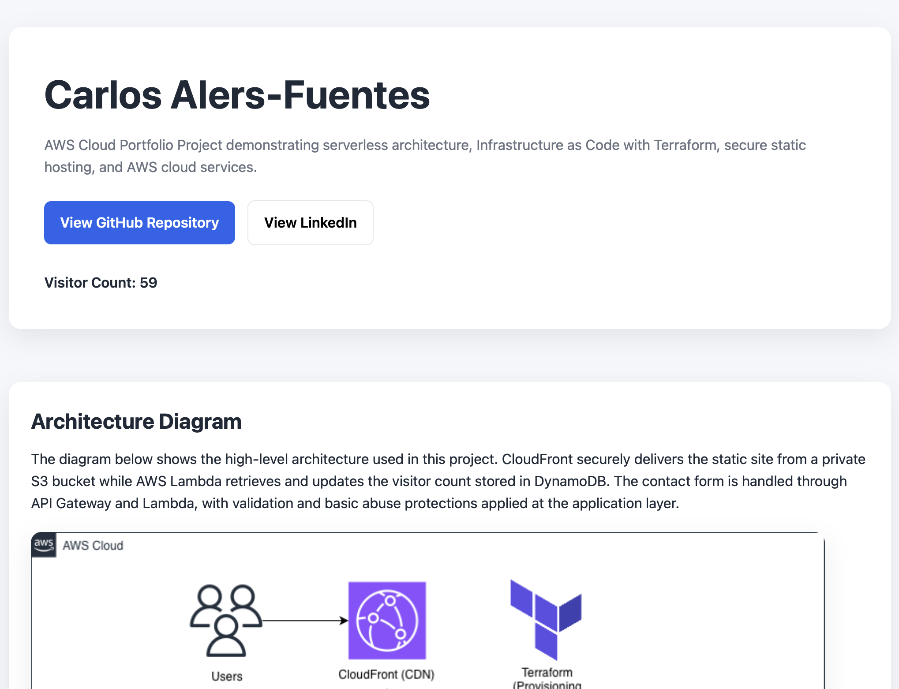
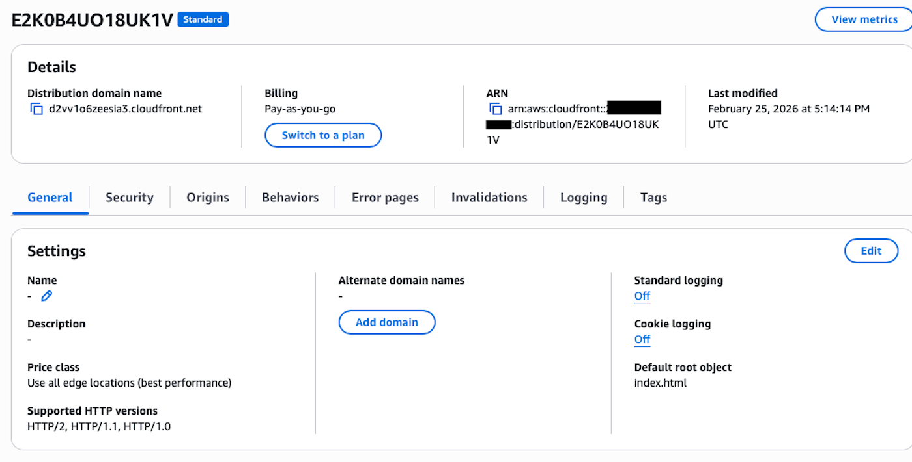
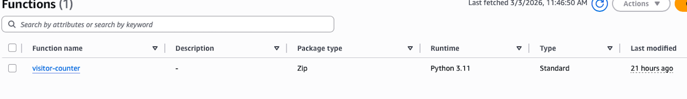
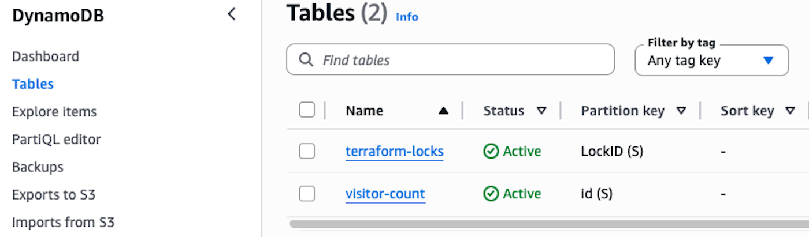
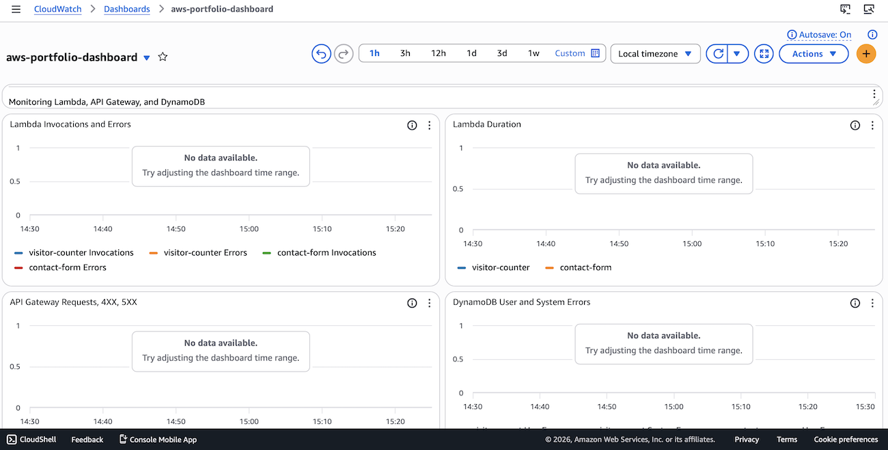
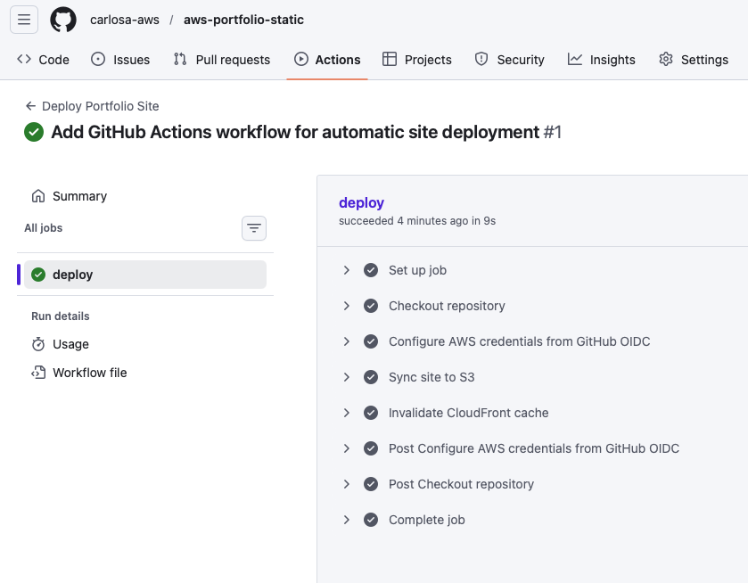

# AWS Serverless Portfolio Website

A fully serverless personal portfolio website hosted on AWS using:

- Amazon S3
- Amazon CloudFront
- Amazon API Gateway
- AWS Lambda
- Amazon DynamoDB
- Amazon SNS
- Amazon CloudWatch
- Terraform
- GitHub Actions

The site includes:

- Real-time visitor counter
- Serverless contact form
- SNS email notifications
- CloudWatch monitoring and alarms
- Automated CI/CD deployment

This project demonstrates a **production-style serverless architecture** using Infrastructure as Code and AWS best practices.

---

# Architecture Overview



This project implements a fully serverless architecture.

### AWS Services Used

- **Amazon CloudFront** – CDN serving the website globally
- **Amazon S3** – private static site origin
- **Amazon API Gateway** – public API endpoints
- **AWS Lambda** – serverless backend compute
- **Amazon DynamoDB** – NoSQL database
- **Amazon SNS** – email notifications for contact form
- **Amazon CloudWatch** – monitoring dashboards and alarms
- **Terraform** – infrastructure as code
- **GitHub Actions** – CI/CD deployment pipeline

---

# Live Website



The live portfolio site demonstrates:

- dynamic visitor counter
- working contact form
- fully automated deployments

---

# Architecture Flow

## Visitor Counter Flow

1. User visits the website
2. CloudFront serves the static site from S3
3. JavaScript calls the **GET /visitor API**
4. API Gateway triggers the **visitor counter Lambda**
5. Lambda updates the **DynamoDB visitor table**
6. Visitor count is returned to the website

---

## Contact Form Flow

1. User submits the contact form
2. Frontend sends POST request to **API Gateway**
3. API Gateway triggers **contact form Lambda**
4. Lambda validates the request
5. Message is stored in **DynamoDB**
6. **SNS sends email notification**
7. Response returned to the website

---

# CloudFront Distribution

CloudFront delivers the site globally via HTTPS.



### Security

The S3 bucket is **not publicly accessible**.

CloudFront accesses the bucket using:

**Origin Access Control (OAC)**

This ensures:

- direct access to the S3 bucket is blocked
- only CloudFront can retrieve the site files

---

# Serverless APIs

The site uses **Amazon API Gateway** to expose two endpoints.

| Endpoint | Method | Purpose |
|--------|--------|--------|
| /visitor | GET | Retrieves and increments visitor count |
| /contact | POST | Processes contact form submissions |

API Gateway provides:

- request routing
- throttling
- secure HTTPS endpoints

---

# AWS Lambda Functions



Two Lambda functions power the backend.

## Visitor Counter Lambda

Language: **Python**

Responsibilities:

- increments visitor count
- retrieves updated count
- returns JSON response to website

---

## Contact Form Lambda

Language: **Python**

Responsibilities:

- validates user input
- prevents spam and malformed requests
- stores message in DynamoDB
- publishes notification to SNS

Security protections include:

- input validation
- email format validation
- honeypot field detection
- CORS restrictions

---

# DynamoDB Tables



Two DynamoDB tables are used.

## Visitor Counter Table

Stores total site visits.

Example record:

- id:visits
- visit_count: 56

---

## Contact Form Table

Stores contact form submissions.

Fields include:

- message ID
- name
- email
- message
- timestamp

---

# SNS Email Notifications

Amazon SNS is used to send email alerts when a visitor submits the contact form.

Workflow:

Contact Form Submission  
↓  
Lambda processes message  
↓  
Message saved to DynamoDB  
↓  
SNS publishes notification  
↓  
Email sent to site owner

This enables **real-time notifications of incoming messages**.

---

# Monitoring and Observability

The project includes **CloudWatch monitoring and alerting**.



## CloudWatch Dashboard

Tracks key metrics such as:

- Lambda invocations
- Lambda errors
- API Gateway requests
- DynamoDB activity

---

## CloudWatch Alarms

Alarms notify if issues occur such as:

- Lambda errors
- elevated error rates
- unexpected API activity

This demonstrates **basic production monitoring practices**.

---

# Infrastructure as Code (Terraform)

Terraform is used to provision and manage all AWS resources.

Managed resources include:

- S3 bucket
- CloudFront distribution
- API Gateway
- Lambda functions
- DynamoDB tables
- SNS topic
- IAM roles and policies
- CloudWatch dashboards
- CloudWatch alarms

Example Terraform files:

- infra/main.tf
- infra/versions.tf

Terraform allows:

- reproducible infrastructure
- version-controlled cloud architecture
- safe updates via `terraform plan` and `terraform apply`

---

# CI/CD Pipeline (GitHub Actions)



The project uses **GitHub Actions** for automatic deployment.

Whenever code is pushed to the **main branch**, the workflow:

1. Authenticates to AWS using **OIDC**
2. Syncs site files to the S3 origin bucket
3. Invalidates the CloudFront cache
4. Deploys the updated site globally

---

## Deployment Flow

Developer Push → GitHub  
↓  
GitHub Actions Workflow  
↓  
Upload site to S3  
↓  
Invalidate CloudFront cache  
↓  
Updated site deployed worldwide

---

# Project Structure

```
aws-portfolio-static
│
├── .github/
│   └── workflows/
│       └── deploy-site.yml
│
├── infra/
│   ├── main.tf
│   └── versions.tf
│
├── lambda/
│   ├── visitor_counter.py
│   └── contact_form.py
│
├── site/
│   ├── index.html
│   └── images/
│
├── docs/
│   └── images/
│
├── .gitignore
└── README.md
```
---

# Security Best Practices Implemented

- S3 bucket **public access blocked**
- CloudFront **Origin Access Control**
- IAM **least privilege policies**
- API Gateway **request throttling**
- Input validation on contact form
- Email format validation
- Honeypot spam protection
- CORS restrictions
- Infrastructure managed with **Terraform**

---

# Cost

This architecture runs **within AWS Free Tier for low traffic sites**.

Typical monthly cost for low traffic:

$0 – $5 per month

Major cost components:

- CloudFront requests
- Lambda executions
- DynamoDB read/write capacity
- API Gateway requests
- SNS email notifications

---

# Skills Demonstrated

- AWS Serverless Architecture
- CloudFront CDN configuration
- Secure S3 architecture
- AWS Lambda development (Python)
- API Gateway design
- DynamoDB data modeling
- SNS event notifications
- CloudWatch monitoring and alarms
- Infrastructure as Code (Terraform)
- CI/CD automation with GitHub Actions

---

# References

The following resources were used while building this project:

- AWS Documentation — https://docs.aws.amazon.com
- Amazon S3 Documentation — https://docs.aws.amazon.com/s3
- Amazon CloudFront Documentation — https://docs.aws.amazon.com/cloudfront
- AWS Lambda Documentation — https://docs.aws.amazon.com/lambda
- Amazon DynamoDB Documentation — https://docs.aws.amazon.com/dynamodb
- Amazon API Gateway Documentation — https://docs.aws.amazon.com/apigateway
- Amazon SNS Documentation — https://docs.aws.amazon.com/sns
- Amazon CloudWatch Documentation — https://docs.aws.amazon.com/cloudwatch
- Terraform Documentation — https://developer.hashicorp.com/terraform/docs
- GitHub Actions Documentation — https://docs.github.com/actions

---

# Author

Carlos Alers-Fuentes

AWS Certified Solutions Architect – Associate  
CompTIA Network+

