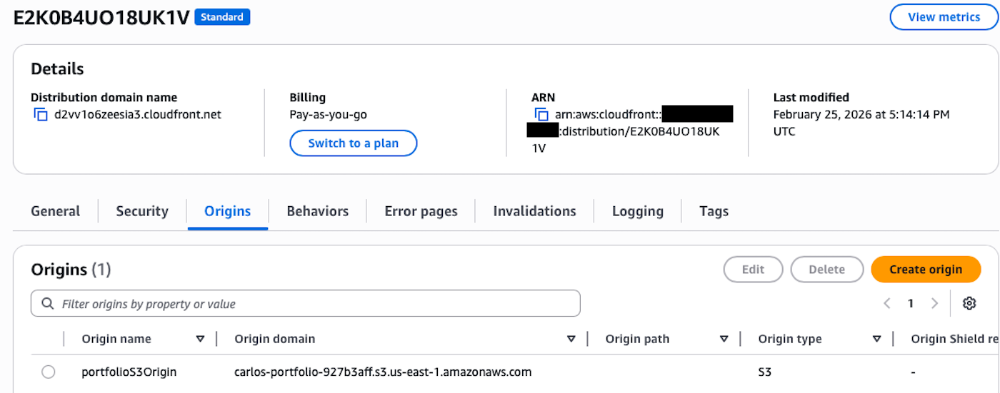
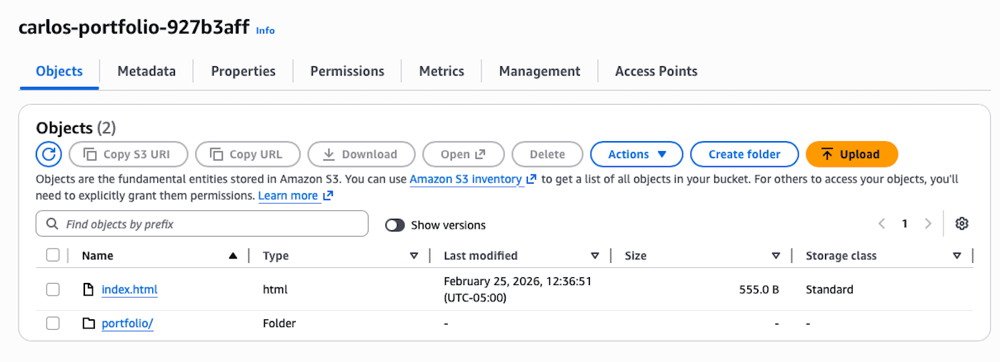
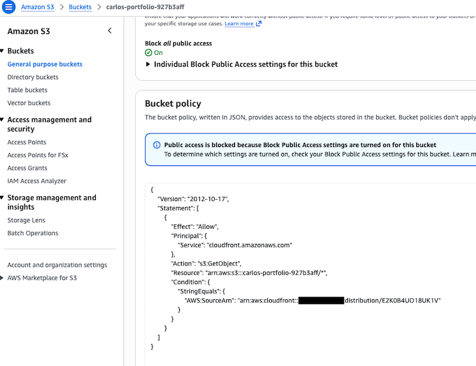
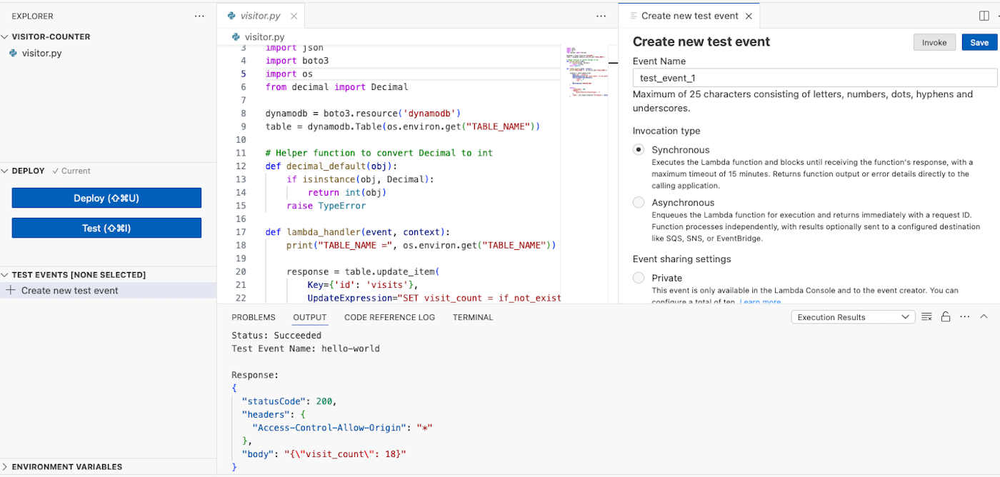
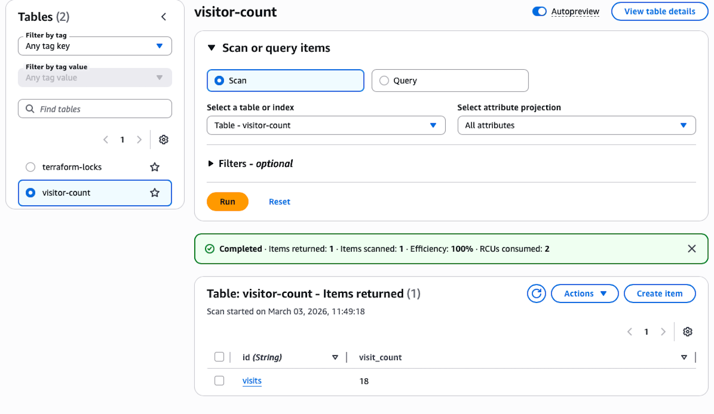
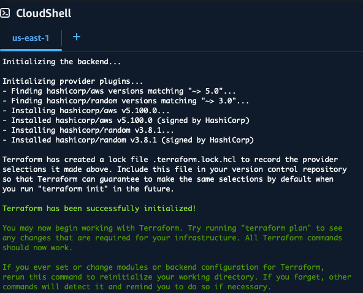
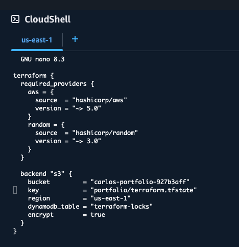
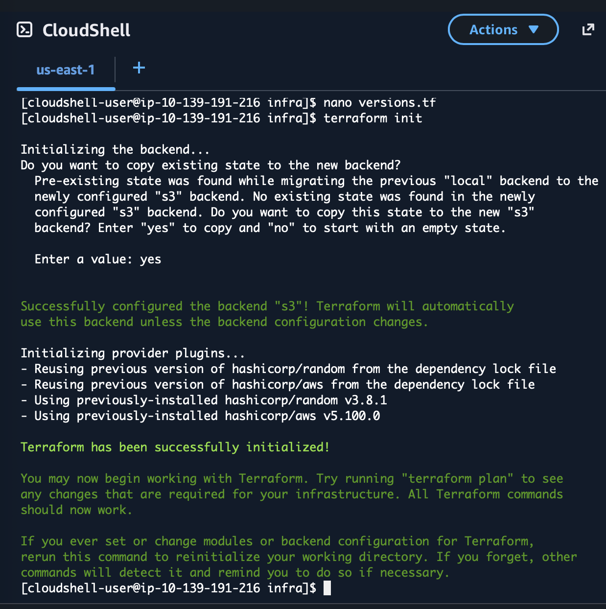

# AWS Serverless Portfolio Website

A serverless personal portfolio website hosted on AWS using **S3, CloudFront, Lambda, DynamoDB, and Terraform**.

The site includes a **visitor counter powered by AWS Lambda and DynamoDB**, demonstrating a real-world serverless architecture.

---

# Architecture Overview

This project implements a fully serverless architecture.

Services used:

- Amazon S3 – static website hosting
- Amazon CloudFront – CDN and HTTPS delivery
- AWS Lambda – serverless visitor counter
- Amazon DynamoDB – NoSQL database storing visitor counts
- Terraform – Infrastructure as Code

Architecture flow:

1. User visits the website
2. CloudFront serves the static site from S3
3. JavaScript calls a Lambda function
4. Lambda updates DynamoDB visitor count
5. Updated visitor count is returned to the website

---

# Live Website

---

# CloudFront Distribution

CloudFront delivers the site globally and securely via HTTPS.

## Origin Access Control (OAC)

CloudFront accesses the S3 bucket privately using Origin Access Control.

---

# S3 Private Static Site

The static site is stored in a **private S3 bucket**. Public access is blocked and only CloudFront can access the bucket.

---

# AWS Lambda Visitor Counter

A Python Lambda function increments and retrieves the visitor count stored in DynamoDB.

## Lambda Test Execution

---

# DynamoDB Visitor Counter Table

Visitor counts are stored in a DynamoDB table.

---

# Infrastructure as Code (Terraform)

Terraform is used to provision and manage AWS resources.

## Terraform Initialization

## Terraform Backend Configuration

---

# Project Structure

aws-portfolio-static

infra/
- main.tf
- versions.tf

lambda/
- visitor_counter.py

site/
- index.html

docs/
- images/

---

# Security Best Practices Implemented

- S3 bucket **public access blocked**
- Access restricted via **CloudFront Origin Access Control**
- Lambda uses **least privilege IAM permissions**
- DynamoDB access restricted to Lambda execution role
- Infrastructure managed through **Terraform**

---

# Future Improvements

Planned enhancements for the project include:

## CI/CD Pipeline

Implement automated deployments using:

- GitHub Actions
- Terraform automation
- Infrastructure validation

## Contact Form

Add a serverless contact form using:

- API Gateway
- AWS Lambda
- DynamoDB

This will allow visitors to send messages directly through the portfolio site.

## Monitoring and Logging

Add observability tools such as:

- CloudWatch dashboards
- CloudWatch alarms

---

# Cost

This architecture runs **within AWS Free Tier for low traffic**.

Estimated monthly cost after free tier:

$0 – $3 per month

---

# Skills Demonstrated

- AWS Serverless Architecture
- CloudFront CDN configuration
- Secure S3 architecture
- AWS Lambda development (Python)
- DynamoDB data persistence
- Infrastructure as Code (Terraform)
- Git and GitHub workflow

---

# Author

Carlos Alers-Fuentes

AWS Certified Solutions Architect – Associate  
CompTIA Network+

